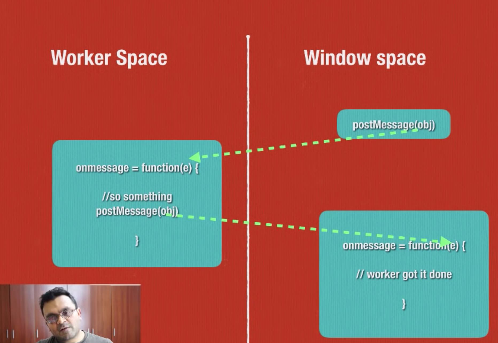

# web-workers

- Javascript is single threaded application i.e. you can't run multi tread
- If code is doing some heavy compute then page will be frozen and unresponsive
- Async call is not multi threading, this is called non blocking. It still uses single thread.
- Web worker provides mechanism to spawn a separate script in background for your web application, where you can do any type  of complex computations without impacting main page performance.
- Web worker doesn't have access of DOM, window object or parent object
- Web worker may make HTTP call, can access navigator object i.e. geo location etc
- Web worker can do timeout
- Web worker can access application cache
- From one web worker, you can spawn other workers
- You can terminate worker
- You can send messaged between worker and pages 
- It helps to delegate computational overhead to workers

# Reference 
https://www.youtube.com/watch?v=O1WmnLCLk3Q
https://github.com/GeekLaunch/web-worker